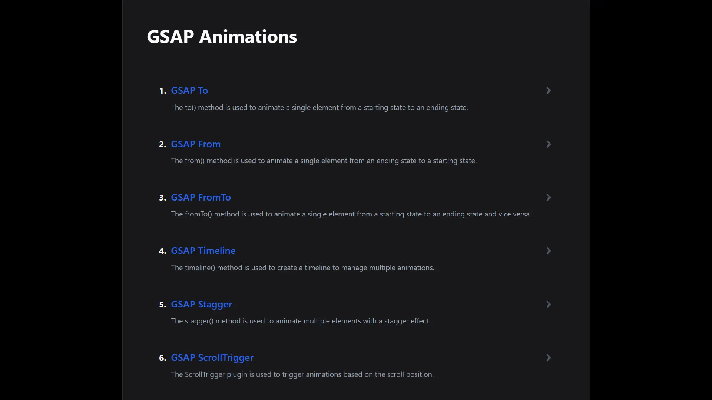

<div align="center">
    <a href="https://gsap-fv.netlify.app" target="_blank">
      
    </a>
  <h3 align="center">GSAP Course</h3>
</div>

##  <br /> 📋 <a name="table">Table of Contents</a>

- ✨ [Introduction](#introduction)
- ⚙️ [Tech Stack](#tech-stack)
- 🚀 [Quick Start](#quick-start)


##  <br /> <a name="introduction">✨ Introduction</a>


**[EN]** Simple GSAP course showcasing various primary animations. GSAP (GreenSock Animation Platform) is used to create fluid and engaging animations.


**[FR]** Cours simple sur GSAP présentant diverses animations principales. GSAP (GreenSock Animation Platform) est utilisé pour créer des animations fluides et captivantes.


##  <br /> <a name="tech-stack">⚙️ Tech Stack</a>

- **React** is a popular JavaScript library for building user interfaces, particularly single-page applications where data changes over time. React's component-based architecture allows developers to create reusable UI components, making development more efficient and the codebase easier to maintain. 

- **GSAP** (GreenSock Animation Platform) is a powerful JavaScript library for creating high-performance animations. It excels in animating HTML elements with smoothness and precision, making it ideal for enhancing user interfaces and web experiences. GSAP's robust API allows developers to create complex animations easily, leveraging timelines and plugins for advanced control and customization. Its efficient rendering engine ensures animations run smoothly across different browsers and devices, providing a seamless user experience.

- **Vite** is a modern frontend build tool known for fast ES Module imports, efficient bundling, and quick development server startup times. It supports frameworks like Vue.js and React, optimizing workflow and performance compared to traditional bundlers.


## <br /> <a name="quick-start">🚀 Quick Start</a>


Follow these steps to set up the project locally on your machine.


<br/>**Prerequisites**


Make sure you have the following installed on your machine:


- [Git](https://git-scm.com/)
- [Node.js](https://nodejs.org/en)
- [npm](https://www.npmjs.com/) (Node Package Manager)


<br/>**Cloning the Repository**


```bash
git clone {git remote URL}
```


<br/>**Installation**

Let's install the project dependencies, from your terminal, run:

```bash
npm install
# or
yarn install
```

<br/>**Running the Project**

Installation will take a minute or two, but once that's done, you should be able to run the following command:

```bash
npm run dev
# or
yarn dev
```

Open [`http://localhost:3000`](http://localhost:3000) in your browser to view the project.

